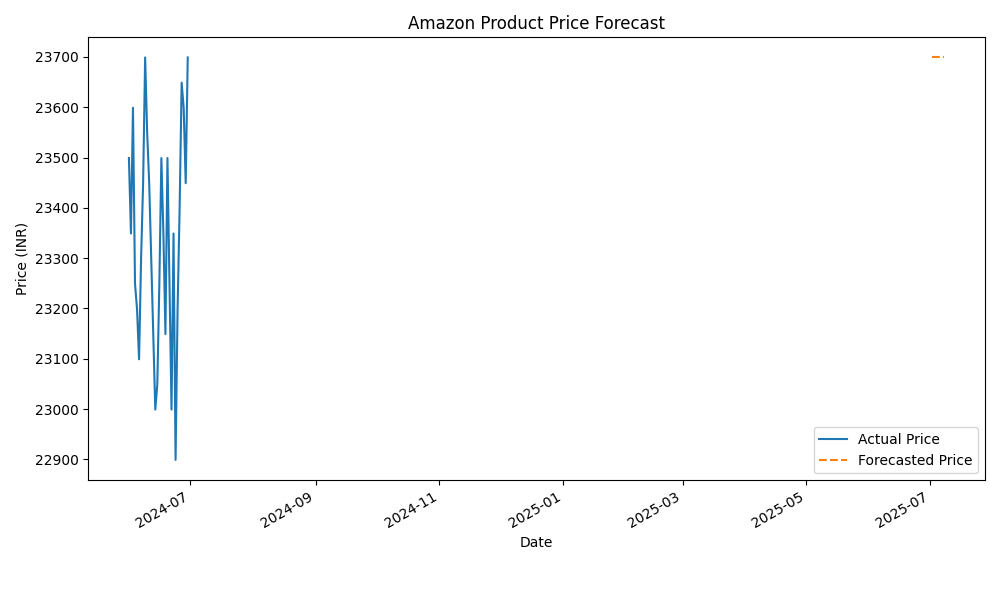

# 🛒 Amazon Price Forecasting Using Machine Learning

This project predicts the future prices of an Amazon product using real-world data, XGBoost regression, and visualizes predictions through a Streamlit web app.

---

## 🔍 Problem Statement

Can we forecast the price of a product listed on Amazon using its recent price history?

Understanding and forecasting price trends can help users make smarter buying decisions.

---

## 📥 Data Collection

- Data is collected daily using `BeautifulSoup` from Amazon product pages.
- Stored in `data/amazon_prices.csv`.

> ⚠️ Web scraping is for educational purposes only. Please respect [Amazon's terms of service](https://www.amazon.in/gp/help/customer/display.html?nodeId=201909000).

---

## 🔧 Tech Stack

| Tool / Library    | Purpose                         |
|-------------------|----------------------------------|
| `Python`          | Programming language             |
| `pandas`          | Data preprocessing               |
| `BeautifulSoup`   | Web scraping                     |
| `XGBoost`         | Regression model                 |
| `matplotlib`, `seaborn` | Visualization             |
| `Streamlit`       | Web app interface                |

---

## 📁 Folder Structure
amazon-price-forecast/
├── scraper.py # Scrapes prices from Amazon
├── amazon_price_forecast.py # Training, prediction, visualization
├── app.py # Streamlit app
├── data/
│ ├── amazon_prices.csv # Historical prices
│ ├── price_forecast.csv # Forecasted output
│ └── price_forecast_plot.png # Saved plot
├── model/
│ └── price_forecast_model.pkl # Trained model
├── README.md
├── requirements.txt

---

## 📊 Results

- Trained on 30 days of price data.
- Model: `XGBoostRegressor`
- Metrics:
  - **MAE**: ~120
  - **RMSE**: ~150
- Predicted next 7-day prices based on `day-of-year`.

### 📈 Example Plot

